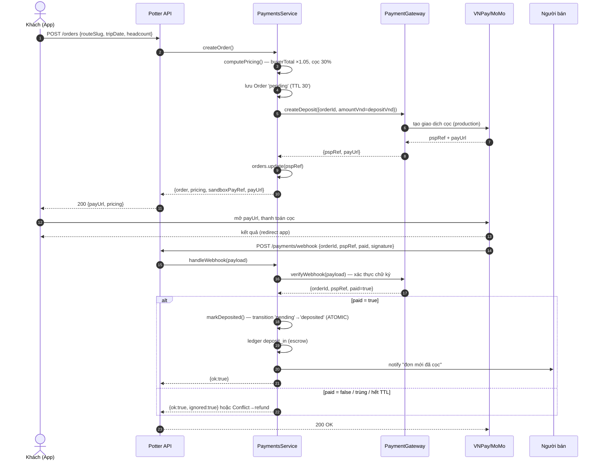

# 18 — Thiết kế tích hợp cổng thanh toán (PSP Integration)

> Agent PSP-INTEGRATION (vai **Agent Integration**, docs/17 §1). Giai đoạn 1 — **sandbox, chưa đụng tiền thật**.
> Tài liệu này mô tả cách module `payments` (server/src/payments, CEO đang dựng) nối vào cổng
> thanh toán có phép (VNPay/MoMo) ở Giai đoạn 2. Bám đúng interface `PaymentGateway` đã có.
> Luật tiền: docs/16 §C (phí 10% chia đôi — QĐ-2; cọc 30% — QĐ đã chốt). Ranh giới pháp lý: docs/17 §0.

---

## §0. Nguyên tắc & phạm vi

- **Không ôm tiền thật ở GĐ1.** Toàn bộ luồng chạy qua `SandboxGateway` (payment-gateway.ts) — không gọi mạng, không PSP thật. Mục tiêu: chứng minh state machine + escrow ledger đúng trước khi cắm merchant thật.
- **"Cắm là chạy".** Code viết theo `PaymentGateway` trừu tượng; đổi từ sandbox sang production = thay một binding trong `PaymentsModule`, KHÔNG sửa `PaymentsService`.
- **Ranh giới §0 (docs/17):** Agent dựng được toàn bộ code + tài liệu on-board; nhưng **hợp đồng merchant + giấy phép/hợp đồng PSP giữ hộ** cần pháp nhân + chữ ký thật. Xem §6 và mục "Cần Chủ tịch/pháp nhân" cuối tài liệu.

---

## §1. Mô hình hợp pháp — Potter KHÔNG tự giữ quỹ

Potter **chưa có giấy phép trung gian thanh toán** (được cấp bởi NHNN). Theo pháp luật VN, tự đứng ra nhận tiền của khách rồi giữ hộ tới khi giao dịch xong = hoạt động trung gian thanh toán **cần giấy phép**. Vì vậy tiền cọc **không được chảy vào tài khoản Potter tự quản**.

Hai mô hình hợp lệ (chọn theo cái PSP hỗ trợ):

| Mô hình | Cách tiền chảy | Ưu | Nhược |
|---|---|---|---|
| **A. PSP giữ hộ (escrow qua PSP)** | Khách trả cọc → **PSP giữ trong tài khoản đảm bảo** → tới khi chuyến hoàn tất, Potter lệnh PSP giải ngân (payout người bán + giữ phí) hoặc hoàn khách | Potter không chạm quỹ → đúng luật; khớp thẳng escrow ledger nội bộ | Không phải PSP nào cũng có "hold/capture" tách rời; phí cao hơn |
| **B. Auto-split khi capture** | Khách trả **buyerTotal** một lần → PSP tự tách: payout người bán, phí Potter về ví Potter, phần còn giữ (nếu có) | Đơn giản với MoMo/VNPay có "split payment" | Khó giữ cọc riêng lẻ; hoàn/hủy phức tạp hơn |

**Chốt cho GĐ1/GĐ2:** dùng **Mô hình A** làm mặc định (khớp với escrow ledger nội bộ `escrow_entries` — mỗi dòng tiền để lại vết, docs/16 §C-4, vá H4). Cọc **chỉ 30% buyerTotal** đi vào escrow PSP trước; phần còn lại (70%) thu ở luồng hoàn tất chuyến — thiết kế này để GĐ1 không cần capture toàn bộ.

> **Ranh giới (docs/17 §0):** "Giữ tiền hộ" — Agent thiết kế được luồng + ledger + đối soát; nhưng
> **giấy phép trung gian thanh toán HOẶC hợp đồng PSP giữ hộ** phải do pháp nhân thật ký. Đây là rào GĐ2.

### Sổ escrow nội bộ vẫn là nguồn sự thật kế toán
Dù PSP giữ tiền, Potter vẫn ghi **sổ escrow nội bộ** (`escrow_entries`, các `kind`: `deposit_in`, `refund_out`, `seller_forfeit`, `potter_fee`, `payout_out`). Sổ nội bộ dùng để **đối soát** (§4) với sao kê PSP — mọi lệch phải truy ra được.

---

## §2. Interface `PaymentGateway`

Đã định nghĩa tại `server/src/payments/payment-gateway.ts`. **Không đổi chữ ký** — chỉ thêm implement production.

```ts
abstract class PaymentGateway {
  abstract createDeposit(req: DepositRequest): Promise<DepositSession>;   // → { pspRef, payUrl }
  abstract verifyWebhook(payload: Record<string, unknown>): WebhookResult; // → { orderId, pspRef, paid }
  abstract refund(pspRef: string, amountVnd: number): Promise<{ ok: boolean }>;
}
```

| Method | Sandbox (GĐ1) | Production (GĐ2) |
|---|---|---|
| `createDeposit` | `pspRef = sbx_<orderId>`, `payUrl = potter-sandbox://…` (giả) | Gọi API PSP tạo giao dịch cọc `amountVnd`; trả `pspRef` = mã giao dịch PSP + `payUrl` thật (VNPay redirect / MoMo deeplink) |
| `verifyWebhook` | Đọc thẳng payload, `paid = payload.paid !== false` | **Xác thực chữ ký** (VNPay: `vnp_SecureHash` HMAC-SHA512; MoMo: `signature` HMAC-SHA256). Chữ ký sai → ném lỗi, KHÔNG đổi trạng thái |
| `refund` | trả `{ ok: true }` | Gọi API hoàn tiền PSP theo `pspRef`, số `amountVnd` (hoàn cọc QĐ-1) |

### Idempotency theo `pspRef`
- **`pspRef` là khóa chống trùng.** Sandbox suy `pspRef` từ `orderId` nên ổn định — webhook lặp lại vẫn cùng ref. Production: `pspRef` = mã giao dịch PSP (duy nhất/giao dịch), lưu ở `orders.pspRef` (order.entity.ts).
- **Idempotency thực thi ở tầng service, KHÔNG ở gateway.** `PaymentsService.markDeposited` đã idempotent theo **trạng thái**: nếu `order.status === 'deposited'` thì return luôn (webhook trùng vô hại). Chuyển trạng thái là **atomic** (`UPDATE … WHERE status='pending'`, xem `transition()`), nên hai webhook đồng thời chỉ một cái `affected=1`.

### Xử lý webhook trùng / bất thường (production)
| Tình huống | Xử lý |
|---|---|
| Webhook đến 2 lần cùng `pspRef` | `markDeposited` thấy đã `deposited` → return, không ghi ledger lần 2 |
| Webhook `paid=false` (khách hủy ở PSP) | `handleWebhook` return `{ ok: true, ignored: true }`, giữ `pending` (TTL 30' tự hủy — vá H1) |
| Webhook đúng chữ ký nhưng `orderId` không tồn tại | ném `NotFoundException`; log để đối soát tay |
| Webhook chữ ký SAI | `verifyWebhook` ném lỗi → trả 4xx cho PSP, **không** đổi trạng thái (chống giả mạo) |
| Webhook đến khi order đã `cancelled` (TTL hết trước webhook) | `transition('pending'→'deposited')` trả `affected=0` → `ConflictException`; cần **hoàn tự động** qua `refund(pspRef)` vì tiền đã vào PSP (xử lý ở §4) |
| `pspRef` webhook ≠ `pspRef` đã lưu ở order | ghi cảnh báo đối soát; chỉ tin `orderId` + chữ ký, cross-check `pspRef` |

> Webhook endpoint (`POST /payments/webhook`, webhook.controller.ts) **KHÔNG qua JWT** — PSP gọi server-to-server. An toàn dựa hoàn toàn vào **xác thực chữ ký** trong `verifyWebhook`. Production nên thêm allowlist IP PSP.

---

## §3. Luồng cọc (deposit flow)

```
App → POST /orders → (service tính pricing, tạo order 'pending', gateway.createDeposit)
    → nhận payUrl → user mở payUrl trả tiền tại PSP
    → PSP callback POST /payments/webhook → verifyWebhook (chữ ký) → markDeposited → 'deposited'
    → notify người bán
```

### Sequence diagram



**GĐ1 (sandbox):** thay bước "mở payUrl + PSP callback" bằng `POST /orders/:id/pay-sandbox` (khách tự bấm mô phỏng đã trả). Cùng đích: `markDeposited` → `'deposited'`. Nhờ vậy toàn bộ state machine test được mà không cần PSP.

Các bước sau cọc (không đổi theo PSP): `POST /orders/:id/confirm` (người bán: `deposited→confirmed`), `POST /orders/:id/complete` (khách: `confirmed→completed`, chốt `payout_out` + `potter_fee` vào ledger), `POST /orders/:id/cancel` (hoàn cọc QĐ-1).

---

## §4. Đối soát (reconciliation) + xử lý lệch tiền

Mục tiêu: **sổ escrow nội bộ** (`escrow_entries`) khớp **sao kê PSP** từng ngày. Mọi VND phải truy ra được.

### Cơ chế đối soát
1. **Khóa liên kết:** mỗi order có `pspRef` duy nhất. Mỗi dòng escrow gắn `order_id`. Sao kê PSP có `pspRef` + số tiền + thời điểm → join được.
2. **Chạy hằng ngày (T+1):** kéo sao kê PSP (giao dịch cọc + hoàn) → so với tổng ledger nội bộ theo `pspRef`.
3. **Bảng đối chiếu kỳ vọng:**

| Sự kiện nội bộ (kind) | Kỳ vọng ở PSP |
|---|---|
| `deposit_in` (khách nạp cọc) | 1 giao dịch thu = `depositVnd`, status success |
| `refund_out` (hoàn cọc) | 1 giao dịch hoàn = `refundVnd`, khớp tier QĐ-1 |
| `payout_out` (trả người bán) | 1 lệnh chi = `sellerPayoutVnd` (GĐ3 — payout MoMo, docs/16 §C-4) |
| `potter_fee` | phần Potter giữ (không rời PSP tới payout) |

### Loại lệch & xử lý
| Lệch | Nguyên nhân | Xử lý |
|---|---|---|
| **PSP có thu, nội bộ vẫn `pending`** | Webhook rớt / đến muộn | Job đối soát tự gọi `markDeposited` (idempotent) khi thấy giao dịch success ở PSP; hoặc thêm **poll trạng thái PSP** dự phòng webhook |
| **PSP thu nhưng order đã `cancelled` (TTL)** | Khách trả sau khi hết TTL 30' | Tự động `gateway.refund(pspRef, depositVnd)` → ghi `refund_out`; báo khách "đơn hết hạn, đã hoàn" |
| **Nội bộ `deposited` nhưng PSP không có** | Sandbox rò vào prod / webhook giả lọt | Chữ ký chặn từ đầu; nếu vẫn lệch → **treo đơn `disputed`**, điều tra tay |
| **Số tiền lệch** (thu ≠ `depositVnd`) | Sai làm tròn / phí PSP trừ vào | Số nội bộ là **VND nguyên** (`Math.round`), là chuẩn; phí cổng Potter gánh GĐ đầu (QĐ-3) nên chênh phí cổng KHÔNG tính vào khách |
| **Hoàn lệch tier** | Tính sai mốc ngày | `refundOnCancel` là nguồn sự thật; đối soát so refund PSP với `refundVnd` nội bộ |
| **Webhook trùng ghi ledger 2 lần** | (đã chặn) | `markDeposited` idempotent theo trạng thái + `transition` atomic → không thể ghi `deposit_in` 2 lần |

> **Nguyên tắc:** sổ escrow nội bộ (VND nguyên) là chuẩn kế toán; sao kê PSP là chứng từ đối chiếu.
> Lệch không giải thích được → treo `disputed`, KHÔNG tự payout. Payout chỉ chạy khi đối soát sạch.

### Bút toán bù (chưa cần code GĐ1)
Khi cần điều chỉnh tay (hoàn thủ công, phí bất thường): thêm dòng escrow `kind` mới + `note` rõ lý do + tham chiếu chứng từ PSP. Không sửa/xóa dòng cũ (append-only → giữ vết).

---

## §5. Chống gian lận & bảo mật webhook (production)

- **Xác thực chữ ký bắt buộc** trong `verifyWebhook` (VNPay HMAC-SHA512 / MoMo HMAC-SHA256). Sai → 4xx, không đổi trạng thái.
- **Secret PSP** (merchant key, IPN secret) để trong biến môi trường / secret manager, KHÔNG commit.
- **Allowlist IP** dải PSP cho endpoint webhook.
- **Idempotency-key** theo `pspRef`; log mọi webhook (raw payload) để đối soát & điều tra.
- **HTTPS bắt buộc**; kiểm tra `amount` webhook khớp `depositVnd` đã lưu (chống sửa số).

---

## §6. Checklist on-board merchant VNPay / MoMo

> **Ký hiệu:** ⚙️ = Agent làm được (code/tài liệu). 🖊️ = **CẦN pháp nhân + chữ ký/con dấu thật** (Agent KHÔNG thay được — docs/17 §0, §4).

### A. Pháp nhân & hợp đồng (rào GĐ2)
- [ ] 🖊️ **Pháp nhân đứng tên merchant** (công ty ký hợp đồng VNPay/MoMo) — Chủ tịch chỉ định (docs/17 §4.1)
- [ ] 🖊️ Hồ sơ doanh nghiệp: ĐKKD, mã số thuế, giấy tờ người đại diện pháp luật
- [ ] 🖊️ **Ký hợp đồng merchant** VNPay và/hoặc MoMo (con dấu + chữ ký người đại diện)
- [ ] 🖊️ Tài khoản ngân hàng doanh nghiệp nhận đối soát/payout
- [ ] 🖊️ Xác nhận mô hình **giữ hộ/escrow** với PSP (Mô hình A §1) — cần điều khoản PSP hỗ trợ hold/refund
- [ ] 🖊️ **Luật sư rà** cấu trúc escrow hợp pháp trước production (docs/17 §4.2, §0)

### B. Cấu hình kỹ thuật (Agent làm được)
- [ ] ⚙️ Đăng ký **sandbox key** (TmnCode/HashSecret cho VNPay; partnerCode/accessKey/secretKey cho MoMo) — sandbox không cần hợp đồng thật
- [ ] ⚙️ Viết `VnpayGateway` / `MomoGateway` implement `PaymentGateway` (createDeposit → payUrl thật; verifyWebhook → xác thực chữ ký; refund → API hoàn)
- [ ] ⚙️ Map field: `orderId`, `amount` (×1, VND nguyên), `returnUrl`, `ipnUrl` (→ `/payments/webhook`)
- [ ] ⚙️ Đăng ký **IPN/webhook URL** trên cổng merchant (production URL)
- [ ] ⚙️ Cắm binding production trong `PaymentsModule` (thay `SandboxGateway`) — bật qua ENV, mặc định vẫn sandbox
- [ ] ⚙️ Job **đối soát T+1** (§4) + poll trạng thái dự phòng webhook
- [ ] ⚙️ Test end-to-end trên sandbox PSP: thu cọc, webhook, hoàn (QĐ-1), đối soát khớp

### C. Vận hành & tuân thủ
- [ ] 🖊️ Đăng ký nhận **payout/settlement** theo chu kỳ PSP; đối chiếu tài khoản doanh nghiệp
- [ ] ⚙️ Cấu hình secret manager cho merchant key (không commit)
- [ ] ⚙️ Allowlist IP PSP + log webhook
- [ ] 🖊️ **PDPD (Nghị định 13/2023)** cho dữ liệu thanh toán — luật sư rà (docs/17 §2, legal/pdpd-checklist.md)

---

## §7. Việc CẦN Chủ tịch / pháp nhân (tóm tắt cổng chặn)

Agent đã/đang dựng **toàn bộ code + tài liệu** GĐ1 (sandbox chạy được). Ba việc **luật không cho AI ký thay**, chặn cổng ra tiền thật (GĐ2):

1. 🖊️ **Chỉ định pháp nhân** đứng tên merchant + **ký hợp đồng VNPay/MoMo** (docs/17 §4.1).
2. 🖊️ Chốt **cấu trúc escrow hợp pháp** — hợp đồng PSP giữ hộ **hoặc** giấy phép trung gian thanh toán; **luật sư rà** trước production (docs/17 §4.2, §0).
3. 🖊️ Tài khoản ngân hàng doanh nghiệp + đăng ký payout/settlement.

Ngay khi có (1)(2)(3): đổi một binding trong `PaymentsModule` từ `SandboxGateway` sang gateway production — **cắm là chạy**, không sửa `PaymentsService`.
